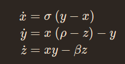
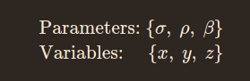

# Lyapunov Analysis

This library provides a set of calculations for numerically finding Lyapunov exponents and vectors of a given dynamical system. 


## Outputs

TBC

### Maximal Lyapunov Exponent of System

Using the class `LyapunovCalculations`.
This class takes the `DynamicalSystem` as an input and produces an array of the maximal Lyapunov exponent over time:

```python
    import LyapunovCalculations from lyapunov_calcs

    dyn_sys = DynamicalSystem()
    maximal_exp_arr = LyapunovCalculation(dyn_sys).max_lyapunov_exp()
```

### Backwards Lyapunov Vectors and Exponents


## Usage/Examples

The class `DynamicalSystem` is imported from the script `system.py`. This class takes the arguments `variables`, `parameters`, `system equations`.

For example, if we want to initialise the [Lorenz system](https://en.wikipedia.org/wiki/Lorenz_system) (this involves using [Sympy](https://www.sympy.org/en/index.html)):

```python
import DynamicalSystem from system
from sympy import symbols

# Definition of symbols used in definiton
x, y, z = symbols('x, y, z')
sigma, rho, beta = symbols('sigma rho beta')

# Collection of system definitions
variables = [x, y, z]
parameters = [sigma, rho, beta]

lorenz_equations = [
    sigma * (y - x),
    x * (rho - z) - y,
    x * y - beta * z
]

# Initialise dynamical system
lorenz = DynamicalSystem(variables, parameters, lorenz_equations)

# Input user defined values of parameters (optional)
parms=[10., 28., 8/3]
lorenz.base_parameters(parms)
```

Here the system is defined symbolically as:



With the following parameters and variables:



## License

[MIT](/LICENSE)